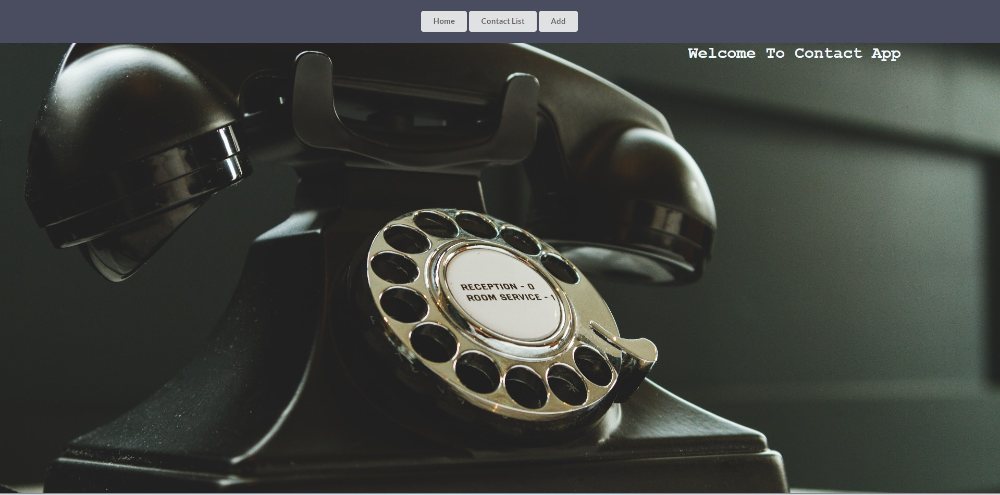

<h1 align="center">Contact App Website</h1>
<h2 align="center">Workshop MERN</h2>

  

<h3>This is Contacts App . You can use the Contacts app to find someone's contact info or organize contacts with labels like "friends" or "family." </h3>

<h2>Live Demo</h2>

To see a live demo of the website Vite React App <a href="https://vite-contact-app.onrender.com">, visit <strong> Contact App Demo </strong></a>  
  <a href="https://med-salah-ben-amou.onrender.com/" target="_blank"> <strong>Mohamed Salah Ben Amou</strong></a>

 

<h2 align="center">
Features
</h2>
<h3>The website includes the following features:</h3>

Home Page
Contacts List
Add Contact

<h2 align="center">Credits</h2>

The website was built using Vite React & semantic ui CSS framework.

